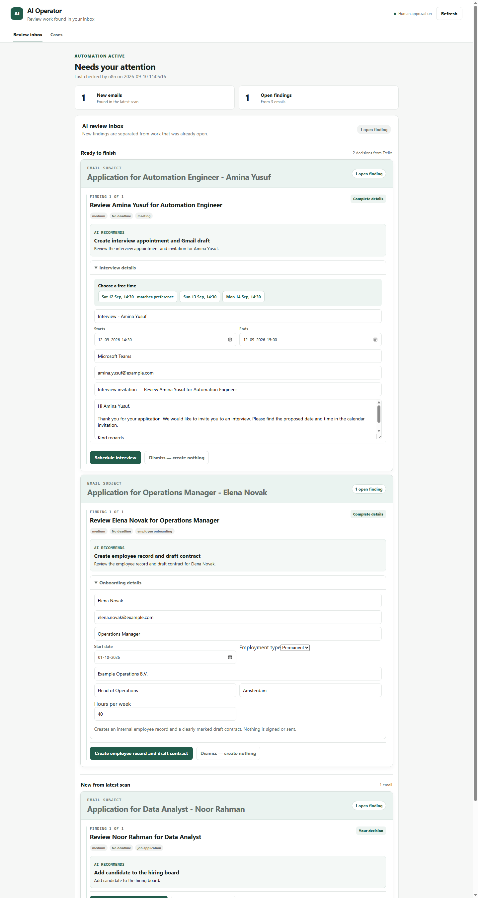
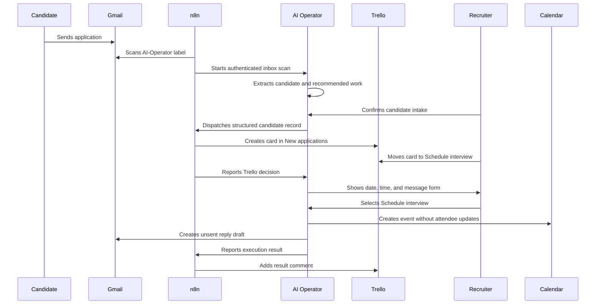

# Recruitment Automation Demo



This demo shows a small but complete AI-assisted recruitment workflow across
Gmail, a Python service, n8n, Trello, Google Calendar, and Gmail drafts.

The goal is not to replace an applicant tracking system. It demonstrates how an
AI operator can understand unstructured email, create structured work, coordinate
multiple business systems, and keep a human in control of consequential actions.

## Business scenario

A candidate applies by email. The system extracts the relevant information,
creates a candidate card, and waits for a recruiter to choose the next step in
Trello. An interview decision produces one short completion form. Scheduling it
creates both a Calendar event and an unsent Gmail draft, then records the result
on the Trello card.



## What this demonstrates

- Structured AI extraction from unstructured email.
- Multi-scenario recognition rather than keyword-only routing.
- Separation between AI reasoning and deterministic execution.
- n8n orchestration across Gmail, Trello, Calendar, and the Python API.
- Idempotent Gmail imports, Trello dispatches, and Trello decision polling.
- Human control at the business decision and execution-detail boundaries.
- Audit history and safe retries when an integration is temporarily unavailable.
- No automatic email sending.

## Prerequisites

Before running the demo:

1. Complete the installation in the main [README](../README.md).
2. Configure Google OAuth for Gmail and Google Calendar.
3. Start the local stack with `./scripts/start-n8n.ps1`.
4. Configure the n8n workflows described in [Local n8n](n8n-local.md).
5. Create the Trello lists `New applications`, `Schedule interview`,
   `Interview confirmed`, `Hired`, `On hold`, and `Rejected`.
6. Create the Gmail label `AI-Operator`.

Credentials, tokens, local databases, Trello IDs, and webhook secrets must remain
local. The workflow templates intentionally contain placeholders instead of
account-specific values.

## Five-minute demo

### 1. Send a fictional application

Send this message to the Gmail account connected to the operator:

**Subject:** `Application for Backend Developer - Sarah Johnson`

```text
Hi,

I would like to apply for the Backend Developer position.

I have five years of experience with Python, FastAPI, PostgreSQL and Docker.
I am available for an interview next week, preferably Tuesday or Wednesday
afternoon.

Kind regards,
Sarah Johnson
```

Apply the Gmail label `AI-Operator`. The current pilot uses an explicit label as
its safe intake boundary.

### 2. Run or await inbox automation

Wait for the published **AI Operator - Scheduled inbox scan** workflow, or run it
manually in n8n. Scheduled scans inspect up to 50 labeled messages and skip Gmail
message IDs that were already processed.

Open `http://127.0.0.1:8000/dashboard`. Confirm the AI finding with
**Send candidate to hiring board**. This single action stores the candidate and
dispatches the structured record through n8n to Trello.

### 3. Make the hiring decision

Open the Trello board and move the candidate card from `New applications` to one of:

- `Schedule interview` to prepare scheduling and an invitation draft.
- `Rejected` to prepare a rejection draft.
- `On hold` to record the status without creating an external action.

The Trello move is the hiring decision. The dashboard does not ask for the same
decision again.

### 4. Complete the interview details

For `Schedule interview`, wait up to two minutes for the Trello polling workflow. Open the
dashboard and use the automatically expanded **Ready to finish** section.

Choose one of the three free 30-minute times proposed from Google Calendar, or
use the manual date and time fields as a fallback. Review the optional location,
generated subject, and invitation, then select **Schedule interview** once.

That single click saves the final details and executes the already-authorized
workflow.

### 5. Verify the result

The demo is successful when all of the following are true:

- Google Calendar contains the interview event.
- Gmail contains an invitation draft in the original email thread.
- No email or Calendar attendee update was sent automatically.
- The Trello card is in `Interview confirmed` and contains a result comment.
- The candidate case shows `Interview confirmed`.

Finally, open **Cases**, ask `What is the status of candidate Sarah Johnson?`,
and verify that the answer cites the matching candidate record and reports the
current interview status and next action.

For the rejection path, verify that the card remains in `Rejected`, Gmail
contains a rejection draft, and that no message was sent.

## Create a safe screenshot environment

The repository includes a deterministic seed script that uses only fictional
people and `example.com` addresses:

```powershell
.\venv\Scripts\python.exe .\scripts\seed-demo-data.py --database demo.db
$env:DATABASE_PATH = "demo.db"
.\venv\Scripts\python.exe -m uvicorn main:app --port 8001
```

Open `http://127.0.0.1:8001/dashboard` for screenshots. The disposable
`demo.db` file is ignored by Git and can be regenerated at any time. This avoids
publishing real messages, addresses, tokens, Trello IDs, or operational history.

## Safety design

AI produces structured proposals but does not receive unrestricted connector
access. The API validates every proposal before execution. Gmail integration uses
draft creation only, Calendar uses `sendUpdates=none`, webhook endpoints require a
shared secret, and external operations use persisted idempotency state.

If Calendar creation fails after Gmail draft creation, the operator deletes that
new draft to avoid leaving a misleading partial result.

## Current pilot boundaries

- Gmail labeling is manual; a production deployment would use an administrator-
  reviewed Gmail rule or a dedicated recruitment inbox.
- Trello is acting as a lightweight applicant tracker, not a full ATS.
- The n8n Trello decision workflow polls every two minutes instead of using a
  production webhook.
- CV attachment parsing and job-specific scorecards are not part of this demo.
- Availability is extracted as context but a recruiter still selects the final
  interview time.
- The service is configured for one local operator, not organizational tenancy
  or role-based access control.

These constraints keep the portfolio demo small, safe, and reproducible while
leaving clear production extensions.

## Suggested production extensions

1. Parse CV attachments and show source-grounded candidate evidence.
2. Match candidates against human-defined role criteria without automated hiring
   decisions.
3. Replace polling with signed Trello webhooks.
4. Add recruiter and hiring-manager roles with explicit audit identities.
5. Add calendar availability lookup and propose valid time slots.
6. Deploy the API and n8n behind managed authentication, TLS, monitoring, and a
   production database.
